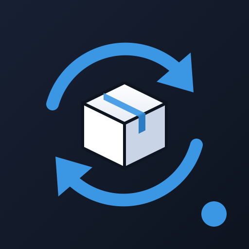
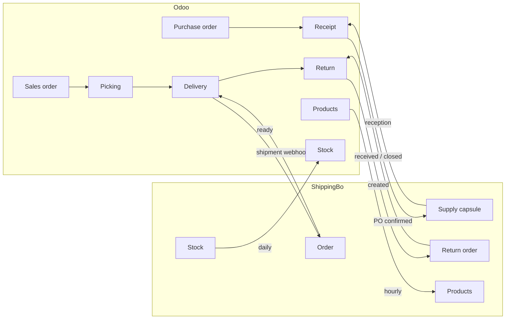

<p align="center">
  
</p>

<h1 align="center">ShippingBo Connector for Odoo</h1>

<p align="center">
  <strong>Run your warehouse from Odoo. Let ShippingBo do the rest.</strong><br/>
  Deliveries, purchase receipts, customer returns, products and stock, kept in sync both ways, automatically.
</p>

<p align="center">
  
  
  
</p>

---

## Why this connector

Your logistics provider works in ShippingBo. Your sales, purchasing and accounting live in Odoo. Without a connector, someone re-keys orders, chases tracking numbers and reconciles stock in spreadsheets.

This module makes the two systems behave as one:

- **Your warehouse only receives what it can ship.** Deliveries are sent once they are actually ready in Odoo, not when the order is confirmed.
- **Odoo stays the system of record.** Shipments, receptions and returns done in the warehouse come back as validated transfers, with real quantities, tracking numbers and backorders.
- **Nothing gets lost.** Every exchange is idempotent, traced and replayable, and webhooks are backed by a polling safety net.
- **No custom development needed.** Install, fill in your API credentials, tick a few boxes.

---

## Features at a glance

| Flow | Direction | What happens |
|---|---|---|
| **Deliveries** | Odoo → ShippingBo | A delivery order is pushed to ShippingBo as soon as it is ready, with addresses, lines, prices, carrier and preparation date. |
| **Shipments** | ShippingBo → Odoo | When the warehouse ships, the delivery is validated in Odoo with the shipped quantities, carrier and tracking number. Partial shipments create a backorder. |
| **Order status** | ShippingBo → Odoo | ShippingBo order states (in preparation, shipped, delivered, in trouble…) are reflected on the transfer. |
| **Purchase receipts** | Odoo → ShippingBo | Confirming a purchase order announces the expected goods to the warehouse (ShippingBo *supply capsule*). |
| **Receptions** | ShippingBo → Odoo | Received quantities validate the receipt in Odoo. Partial receptions create a backorder for the balance. |
| **Customer returns** | Odoo ↔ ShippingBo | A return created from a delivery is announced to the warehouse (ShippingBo *return order*). Received items are put back in stock, and items declared not restockable are scrapped. |
| **Product catalog** | Odoo → ShippingBo | Product variants are created and updated in ShippingBo: reference, EAN, name and weight. |
| **Stock levels** | ShippingBo → Odoo | Odoo on-hand quantities are aligned with ShippingBo, the physical source of truth, through traceable inventory adjustments. |
| **Cancellations & changes** | Odoo → ShippingBo | Cancel an order, receipt or return from Odoo. Changing a purchase order updates the expected receipt in ShippingBo. |

---

## How it works



**One principle drives the design:** every exchange is anchored on an **Odoo transfer** (delivery, receipt or return), never on the sales or purchase order. Split shipments, backorders and multi-step routes therefore work naturally.

### Deliveries

1. The delivery order becomes **Ready**: in a two-step route, that is when the picking is validated.
2. It is sent to ShippingBo, automatically or with the **Send to Shippingbo** button.
3. The ShippingBo order ID and a **Shippingbo Status** are displayed in a dedicated *Shippingbo* tab.
4. When the warehouse ships, the `Shipment` webhook validates the delivery with the shipped quantities, sets the carrier through a configurable mapping, and stores the tracking number.
5. A partial shipment creates a backorder that stays attached to the same ShippingBo order, so the next shipment validates it.

### Purchase receipts

1. Confirming the purchase order sends its receipt to ShippingBo as a supply capsule (expected products and quantities, supplier, expected date, purchase reference).
2. Each reception reported by ShippingBo validates the receipt for the received quantity, and the balance goes to a backorder.
3. Changing the purchase order before the reception starts replaces the capsule in ShippingBo. Once the reception has started, the change is flagged instead of overwriting warehouse data.

### Customer returns

1. Creating a return from a delivery sent to ShippingBo announces it as a return order, linked to the original ShippingBo order, with only the returned lines.
2. When the warehouse receives it, the return is validated with the **physically received** quantities, not the declared ones.
3. Items flagged **not restockable** are automatically scrapped in Odoo, so damaged goods never reach sellable stock.
4. Cancelling a return that was not received yet cancels it in ShippingBo (for example, a parcel lost in transit).

### Products and stock

- **Catalog:** every hour, variants flagged *Shippingbo Stock Sync* and modified since their last sync are created or updated in ShippingBo. The ShippingBo product ID is stored on the variant.
- **Stock:** every day, ShippingBo stock levels are applied to Odoo as **inventory adjustments**, so every correction stays visible in the stock moves history.

---

## Built for production

**Idempotent by design.** Re-sending, replaying a webhook or running a cron twice never creates duplicates:
- Odoo stores every ShippingBo ID.
- Receptions are computed as *received minus already received*.
- Scraps are applied only for the part not scrapped yet.
- When ShippingBo answers that a receipt already exists (409 Duplicate), Odoo attaches to the existing one.

**Webhooks plus a safety net.** A polling job re-reads open receipts and returns every 30 minutes. Partial receptions that do not change the ShippingBo state are still picked up.

**Fully traceable.**
- Every outgoing write call and every incoming webhook is logged in **Settings › Technical › Logging**, with its payload and response.
- These entries are written outside the business transaction, so failures are never lost, and are purged automatically after 7 days.
- Business events are posted in the transfer's chatter.

**Errors you can act on.**
- A rejected send sets the transfer to *Error*, with ShippingBo's message in the chatter.
- A business user fixes the data and clicks **Send to Shippingbo** again, without needing technical logs.

**Safe defaults.**
- Unknown stock values are never read as zero.
- Products tracked by lot are never validated blindly.
- A failed automatic send never blocks the stock reservation that triggered it.

**Multi-warehouse ready.** Only warehouses flagged *Synced with Shippingbo* exchange data. A second warehouse run by another logistics provider is left untouched.

**Multilingual.** All user-facing texts follow the user's language. English and French are included.

---

## Installation

1. Copy `shippingbo_connector` into your addons path, or deploy it on Odoo.sh.
2. Update the apps list and install **ShippingBo Connector**.
3. Dependencies (installed automatically): `stock`, `sale`, `sale_stock`, `purchase_stock`, `delivery`, `stock_delivery`.
4. Python dependency: `requests` (already shipped with Odoo).

---

## Configuration

### 1. API credentials: *Settings › ShippingBo*

| Setting | Description |
|---|---|
| Client ID / Client Secret | OAuth2 credentials of your ShippingBo application |
| App ID | ShippingBo application ID (sent in the `X-API-APP-ID` header) |
| Redirect URI | The URI registered on your ShippingBo application |
| Refresh Token | Obtained once through the OAuth2 authorization flow; access tokens are then refreshed automatically |

The ShippingBo application needs read/write access to **Order**, **Product**, **SupplyCapsule** and **ReturnOrder**.

### 2. Automation switches: *Settings › ShippingBo*

| Setting | Effect |
|---|---|
| Auto-send ready deliveries | Send deliveries as soon as they are ready |
| Auto-send purchase receipts | Send receipts when a purchase order is confirmed |
| Auto-send returns | Send returns created from a delivery that was sent to ShippingBo |
| Stock Location | Odoo location aligned with ShippingBo stock |

Each flow can also be triggered manually from the transfer with the **Send to Shippingbo** button.

### 3. Warehouses, products, carriers and suppliers

- **Warehouses:** tick *Synced with Shippingbo* on the warehouses run in ShippingBo. It is enabled by default.
- **Products:** tick *Shippingbo Stock Sync* in the *Inventory* tab to include a product in the catalog and stock synchronization. The internal reference is the key shared with ShippingBo.
- **Carriers:** *Settings › Shippingbo › Carrier Mapping* links Odoo delivery methods to ShippingBo carrier names, in both directions.
- **Suppliers:** fill in the supplier **Reference**. It is used as the ShippingBo supplier code, with the supplier name as a fallback.

### 4. Webhooks in ShippingBo

Point ShippingBo webhooks to:

```
https://<your-odoo-domain>/shippingbo/webhook
```

| Object class | Trigger | Used for |
|---|---|---|
| `Shipment` | creation | Shipment validation, tracking |
| `Order` | `state` | Order status |
| `SupplyCapsule` | `state` | Reception of purchase receipts |
| `ReturnOrder` | `state` | Reception of customer returns |

### 5. Recommended

- Set **OdooBot**'s language to your team's language: automatic chatter messages are written in it.
- Set the *Create backorder* option of your receipt and return operation types to **Ask** or **Always**, so partial receptions keep a backorder.

---

## Scheduled actions

| Scheduled action | Frequency | Role |
|---|---|---|
| ShippingBo - Product Synchronization | Hourly | Create and update modified product variants in ShippingBo |
| ShippingBo - Stock Synchronization | Daily | Align Odoo stock with ShippingBo |
| ShippingBo - Receipts & Returns Polling | Every 30 min | Safety net for reception and return webhooks |
| ShippingBo - Logging Cleanup | Daily | Purge ShippingBo log entries older than 7 days |

---

## Technical reference

### Data model

| Model | Fields added |
|---|---|
| `stock.picking` | `shippingbo_order_id`, `shippingbo_capsule_id`, `shippingbo_return_order_id`, `shippingbo_shipment_id`, `shippingbo_state`, `shippingbo_items_map`, `shippingbo_earliest_ship_date` |
| `product.template` | `shippingbo_stock_sync` |
| `product.product` | `shippingbo_product_id`, `shippingbo_last_sync` |
| `stock.warehouse` | `shippingbo_enabled` |
| `shippingbo.carrier.mapping` | New model: Odoo carrier ↔ ShippingBo carrier name |

### ShippingBo endpoints used

| Endpoint | Purpose |
|---|---|
| `POST /addresses`, `POST /orders`, `PATCH /orders/{id}` | Deliveries, cancellation |
| `GET/POST /products`, `PATCH /products/{id}` | Catalog and stock |
| `GET/POST /supply_capsules`, `GET/DELETE /supply_capsules/{id}` | Purchase receipts |
| `POST /return_orders`, `GET/PATCH /return_orders/{id}` | Customer returns |

All calls go through a single client (`shippingbo.api`) that handles OAuth2 token refresh, automatic retry on `401`, and logging.

### Extension points

The module is generic and can be extended without forking. Override these methods in your own module:

| Method | Default behaviour |
|---|---|
| `stock.picking._shippingbo_carton_info(product)` | Splits order lines into cartons and units when carton fields exist on the product |
| `stock.picking._shippingbo_relay_ref()` | Pickup point reference sent with the order |
| `stock.picking._build_shippingbo_payload(so)` | Order payload |
| `stock.picking._build_supply_capsule_payload()` | Receipt payload |
| `stock.picking._build_return_order_payload()` | Return payload |
| `product.product._shippingbo_product_vals()` | Product payload |

---

## Current scope and roadmap

The connector covers the full order-to-delivery, purchase-to-receipt and return cycles. These items are on the roadmap:

- **Lot and batch numbers** on shipments, receptions and returns. Products tracked by lot are currently validated manually, and the user is told so in the chatter.
- **Stock adjustments and scraps entered in Odoo** pushed to ShippingBo.
- **Webhook authentication** with a shared secret.
- **Address change** and **order edit** after a delivery has been sent.

---

## Support

Developed and maintained by **[Catalyt](https://catalyt.fr)**.
Questions, integration projects or custom flows: **[stanislas@catalyt.fr](mailto:stanislas@catalyt.fr)**

## License

[Odoo Proprietary License v1.0 (OPL-1)](LICENSE)
